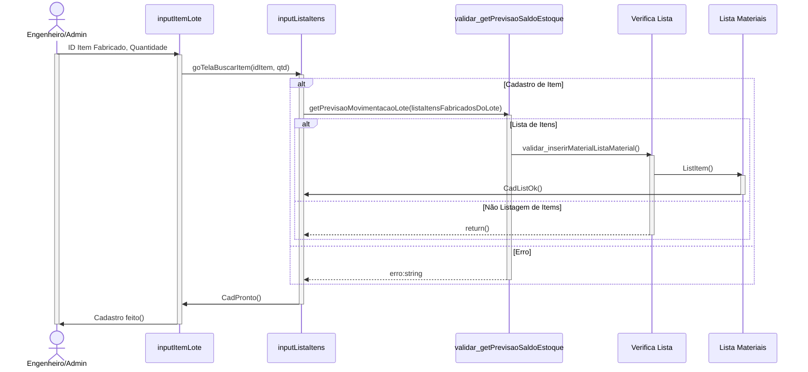

```mermaid
sequenceDiagram 
    % diagrama da tela de novo Item

    actor Engenheiro/Admin
    participant I as inputItemLote
    participant C as inputListaItens
    participant VC as validar_getPrevisaoSaldoEstoque
    participant VL as Verifica Lista
    participant LM as Lista Materiais


    Engenheiro/Admin->>I: ID Item Fabricado, Quantidade
    activate Engenheiro/Admin
    activate I
    I->>C: goTelaBuscarItem(idItem, qtd)
    activate C
    % alterar essa parte pós desenvolvimento do diagrama de classes para colocar o comando padrão que aparece no diagrama.

    alt Cadastro de Item
        C->>VC: getPrevisaoMovimentacaoLote(listaItensFabricadosDoLote)
        % alterar essa parte pós desenvolvimento do diagrama de classes para colocar o comando padrão que aparece no diagrama.
        activate VC
            alt Lista de Itens
            VC->>VL: validar_inserirMaterialListaMaterial()
                    % alterar essa parte pós desenvolvimento do diagrama de classes para colocar o comando padrão que aparece no diagrama.
            activate VL
            VL->>LM: ListItem()
                    % alterar essa parte pós desenvolvimento do diagrama de classes para colocar o comando padrão que aparece no diagrama.
            activate LM
            LM->>C: CadListOk()
                    % alterar essa parte pós desenvolvimento do diagrama de classes para colocar o comando padrão que aparece no diagrama.
            deactivate LM
            else Não Listagem de Items
            VL-->>C: return()
            deactivate VL
            end
    else Erro
        VC-->>C: erro:string
        deactivate VC
    end

    C->>I: CadPronto()
    deactivate C
    I->>Engenheiro/Admin: Cadastro feito()
    deactivate I
    deactivate Engenheiro/Admin

``` 