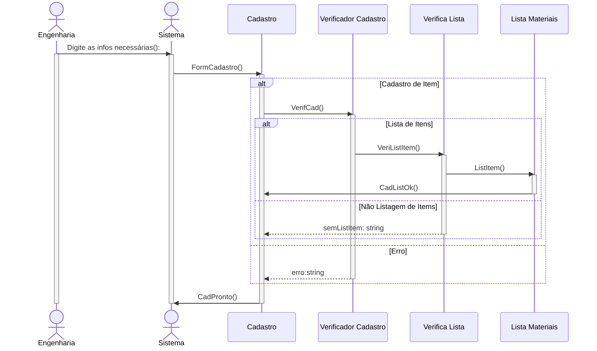

```mermaid
sequenceDiagram 
    % diagrama da tela de novo Item

    actor Engenharia
    actor Sistema
    participant C as Cadastro
    participant VC as Verificador Cadastro
    participant VL as Verifica Lista
    participant LM as Lista Materiais


    Engenharia->>Sistema: Digite as infos necessárias():
    activate Engenharia
    activate Sistema
    Sistema->>C: FormCadastro()
    activate C
    % alterar essa parte pós desenvolvimento do diagrama de classes para colocar o comando padrão que aparece no diagrama.

    alt Cadastro de Item
        C->>VC: VerifCad()
        % alterar essa parte pós desenvolvimento do diagrama de classes para colocar o comando padrão que aparece no diagrama.
        activate VC
            alt Lista de Itens
            VC->>VL: VeriListItem()
                    % alterar essa parte pós desenvolvimento do diagrama de classes para colocar o comando padrão que aparece no diagrama.
            activate VL
            VL->>LM: ListItem()
                    % alterar essa parte pós desenvolvimento do diagrama de classes para colocar o comando padrão que aparece no diagrama.
            activate LM
            LM->>C: CadListOk()
                    % alterar essa parte pós desenvolvimento do diagrama de classes para colocar o comando padrão que aparece no diagrama.
            deactivate LM
            else Não Listagem de Items
            VL-->>C: semListItem: string
            deactivate VL
            end
    else Erro
        VC-->>C: erro:string
        deactivate VC
    end

    C->>Sistema: CadPronto()
    deactivate C
    deactivate Sistema
    deactivate Engenharia

``` 