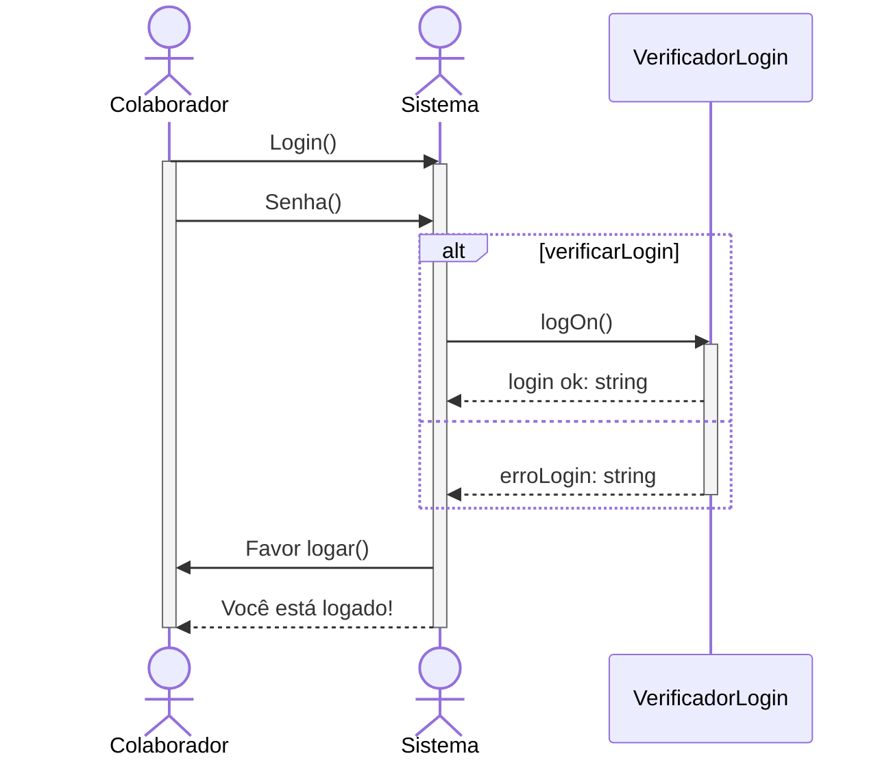

```mermaid
sequenceDiagram
    % diagrama da tela de Login
    actor Colaborador
    actor Sistema
    participant V as VerificadorLogin

    Colaborador->>Sistema: Login()
    activate Colaborador
    activate Sistema
    Colaborador->>Sistema: Senha() 

    alt verificarLogin
        Sistema->>V: logOn()
        activate V
        V-->>Sistema: login ok: string
    else
        V-->>Sistema: erroLogin: string
        deactivate V
    end

    Sistema->>Colaborador: Favor logar()
    
    Sistema-->>Colaborador: Você está logado!
    deactivate Sistema
    deactivate Colaborador
```